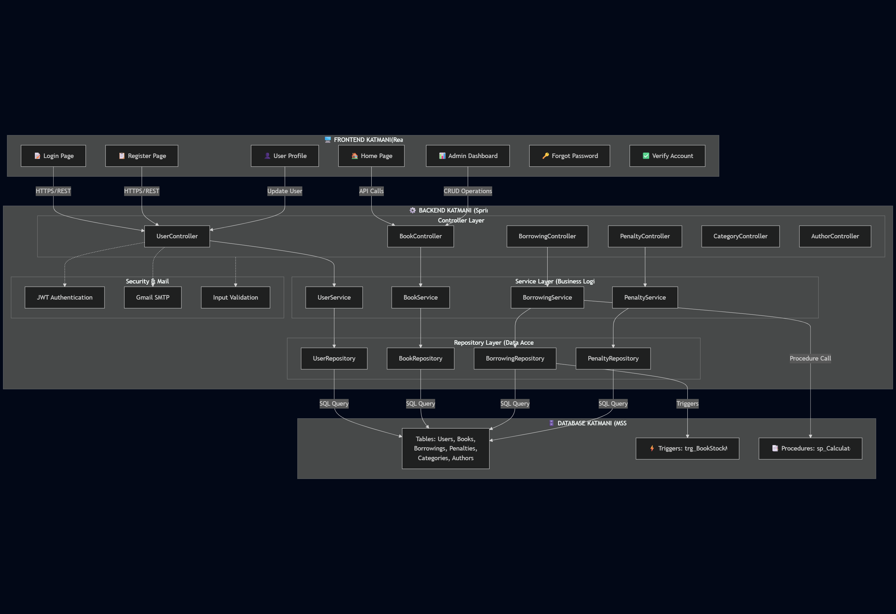
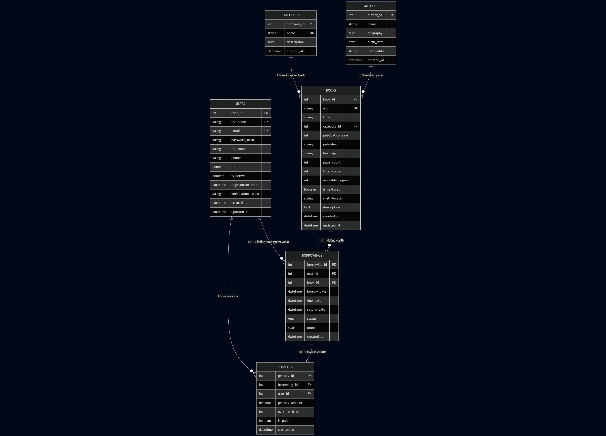
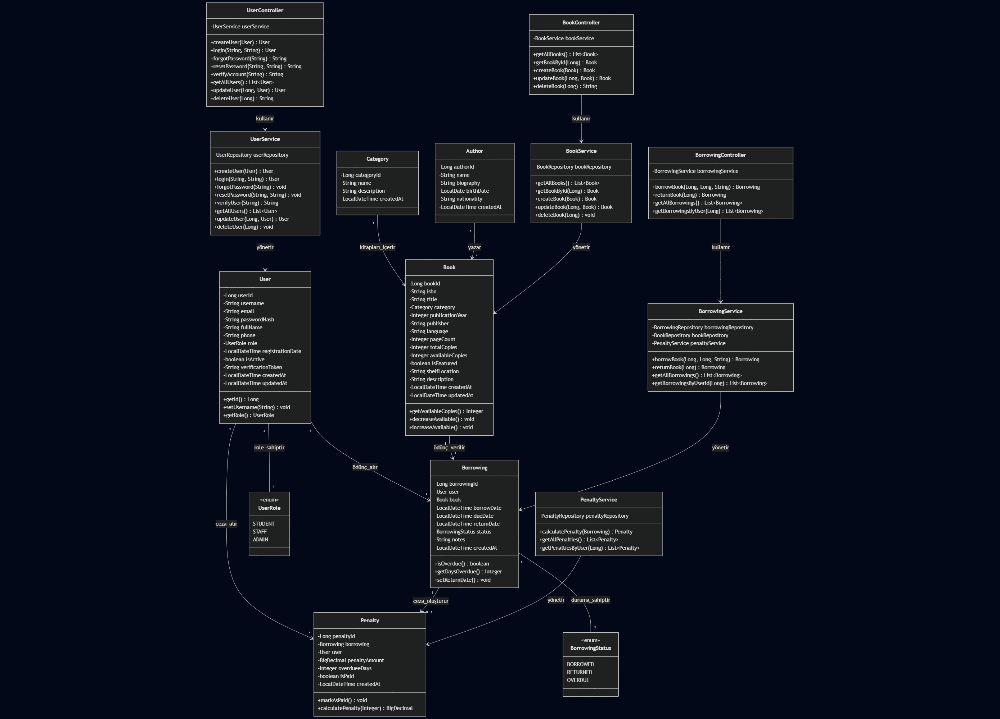
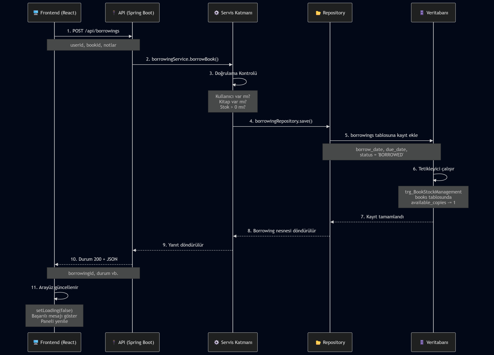
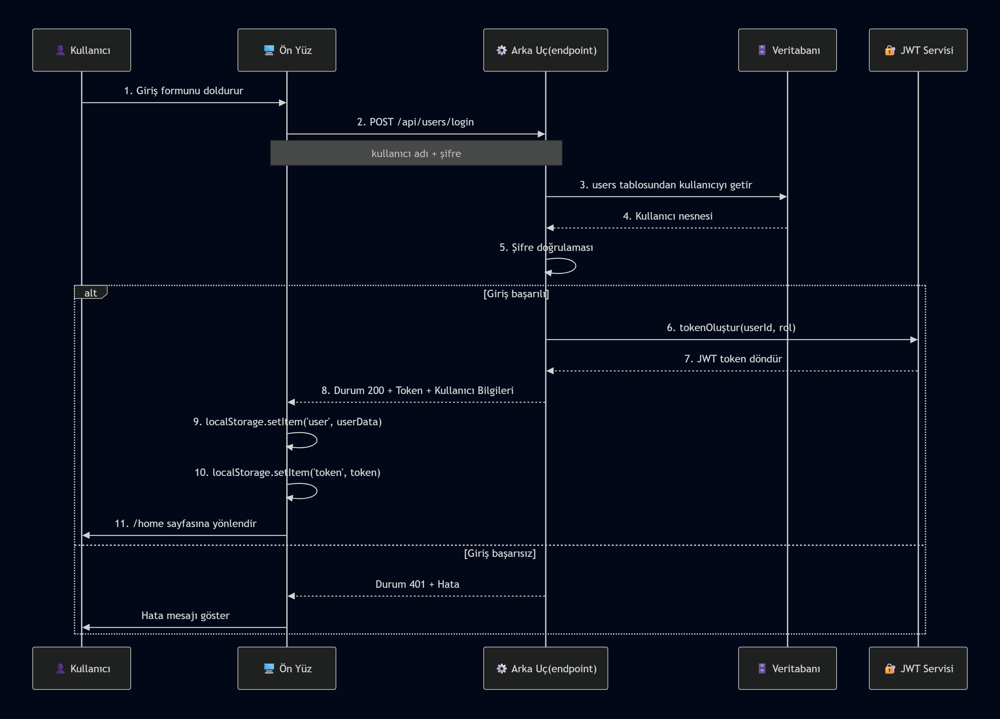

# AKILLı KÜTÜPHANE YÖNETIM SİSTEMİ
## Gereksinim Analizi ve Sistem Tasarım Raporu

**Proje Adı:** Smart Library Management System (Akıllı Kütüphane Yönetim Sistemi)  
**Geliştirici:** Melih Aka (445870)  
---

## İÇİNDEKİLER

1. [Yönetici Özeti](#yönetici-özeti)
2. [Proje Gereksinimleri](#proje-gereksinimleri)
3. [Sistem Mimarisi](#sistem-mimarisi)
4. [Veritabanı Tasarımı](#veritabanı-tasarımı)
5. [Sistem Bileşenleri ve İletişim](#sistem-bileşenleri-ve-i̇letişim)
6. [Güvenlik Mimarisi](#güvenlik-mimarisi)
7. [İş Mantığı ve Otomatik İşlemler](#i̇ş-mantığı-ve-otomatik-i̇şlemler)
8. [API Yapısı](#api-yapısı)
9. [Sonuç ve Öneriler](#sonuç)

---

## YÖNETİCİ ÖZETİ

Akıllı Kütüphane Yönetim Sistemi, modern web teknolojileri kullanılarak geliştirilen, kapsamlı veri yönetimi ve otomasyon özellikleri sunan kurumsal bir uygulamadır. Sistem, öğrenci ve personel kullanıcılarının kitap ödünç alma/iade işlemlerini gerçekleştirmesini, yöneticilerin kütüphane veri tabanını yönetmesini sağlar. 

**Temel Özellikler:**
- JWT tabanlı kimlik doğrulama ve rol tabanlı yetkilendirme
- Otomatik ceza hesaplama sistemi (geç iade için)
- Stok yönetimi ve kitap kullanılabilirliği takibi
- E-posta bildirimleri (şifre sıfırlama, cezalar vb.)
- Responsive kullanıcı arayüzü
- RESTful API mimarisi

---

## PROJE GEREKSİNİMLERİ

### 1.1 İşlevsel Gereksinimler

#### Kullanıcı Yönetimi
- Kullanıcı kaydı (Register)
- Kullanıcı girişi (Login) - başarısız giriş korunması
- E-mail doğrulama (Verification Token)
- Şifre sıfırlama (Password Reset) - e-mail üzerinden
- Şifre unutma (Forgot Password) işlemi
- Profil güncelleme
- Kullanıcı silme (Admin)

#### Kitap Yönetimi
- Kitap listeleme (tüm kullanıcılar)
- Kitap arama (ISBN, başlık, yazar, kategori)
- Kitap ödünç alma (stok kontrolü ile)
- Kitap iade etme (otomatik ceza hesaplama)
- Kitap CRUD işlemleri (Admin)
- Öne çıkan kitaplar listesi

#### Ceza Sistemi
- Geç iade edilen kitaplar için otomatik ceza
- Ceza hesaplama: 5 TL/gün sabit ücret
- Ceza durumu takibi (ödendi/ödenmedi)
- Ceza geçmişi

#### Kategori ve Yazar Yönetimi
- Kategori CRUD (Admin)
- Yazar CRUD (Admin)
- Kitapların kategorilere göre sınıflandırması

### 1.2 Non-Fonksiyonal Gereksinimler

| Gereksinim | Açıklama |
|-----------|----------|
| **Performans** | İlk yükleme < 2 sn, API yanıtı < 500 ms |
| **Ölçeklenebilirlik** | 500+ eşzamanlı kullanıcı desteklemesi |
| **Güvenlik** | HTTPS, JWT tokens, SQL injection korunması |
| **Kullanılabilirlik** | Responsive tasarım, 4 kullanıcı tipi desteği |
| **Bakım Yeteneği** | Katmanlı mimari, açık kod yorum ve belgeler |
| **Veritabanı** | MSSQL Server 2019+ (SQL Authentication) |

---

## SİSTEM MİMARİSİ

### 2.1 Genel Mimari Diyagramı



### 2.2 Teknoloji Stack

**Frontend:**
- React 18+
- Vite (Build Tool)
- Tailwind CSS (Styling)
- React Router (Routing)
- Axios (HTTP Client)

**Backend:**
- Spring Boot 3.4.11
- Java 21
- Spring Data JPA + Hibernate
- Spring Security
- Spring Mail

**Veritabanı:**
- Microsoft SQL Server 2019+
- SQL Server Authentication

**Dış Servisler:**
- Gmail SMTP (port 587)
- SSL/TLS Sertifikası

---

## VERİTABANI TASARIMI

### 3.1 Entity Relationship Diagram (ERD)



### 3.2 Tablo Şemaları

#### USERS Tablosu
```sql
CREATE TABLE users (
    user_id BIGINT PRIMARY KEY IDENTITY(1,1),
    username NVARCHAR(50) UNIQUE NOT NULL,
    email NVARCHAR(100) UNIQUE NOT NULL,
    password_hash NVARCHAR(250) NOT NULL,
    full_name NVARCHAR(100) NOT NULL,
    phone NVARCHAR(50),
    role NVARCHAR(20) NOT NULL DEFAULT 'STUDENT', -- STUDENT, STAFF, ADMIN
    registration_date DATETIME2 DEFAULT GETDATE(),
    is_active BIT DEFAULT 1,
    verification_token NVARCHAR(500),
    created_at DATETIME2 DEFAULT GETDATE(),
    updated_at DATETIME2 DEFAULT GETDATE()
);
```

**Açıklama:** Sistem kullanıcılarını yönetir. Üç rol destekler: STUDENT (öğrenci), STAFF (personel), ADMIN (yönetici). Verification_token e-mail doğrulaması ve şifre sıfırlama için kullanılır.

#### BOOKS Tablosu
```sql
CREATE TABLE books (
    book_id BIGINT PRIMARY KEY IDENTITY(1,1),
    isbn NVARCHAR(20) UNIQUE,
    title NVARCHAR(200) NOT NULL,
    category_id BIGINT FOREIGN KEY REFERENCES categories(category_id),
    publication_year INT,
    publisher NVARCHAR(100),
    language NVARCHAR(50) DEFAULT 'Türkçe',
    page_count INT,
    total_copies INT DEFAULT 10,
    available_copies INT DEFAULT 10,
    is_featured BIT DEFAULT 0,
    shelf_location NVARCHAR(50),
    description TEXT,
    created_at DATETIME2 DEFAULT GETDATE(),
    updated_at DATETIME2 DEFAULT GETDATE()
);
```

**Açıklama:** Kütüphane kitaplarını depolar. total_copies ve available_copies alanları stok yönetimi için kullanılır. Trigger tarafından otomatik olarak güncellenir.

#### BORROWINGS Tablosu
```sql
CREATE TABLE borrowings (
    borrowing_id BIGINT PRIMARY KEY IDENTITY(1,1),
    user_id BIGINT NOT NULL FOREIGN KEY REFERENCES users(user_id),
    book_id BIGINT NOT NULL FOREIGN KEY REFERENCES books(book_id),
    borrow_date DATETIME2 NOT NULL DEFAULT GETDATE(),
    due_date DATETIME2 NOT NULL,
    return_date DATETIME2,
    status NVARCHAR(20) NOT NULL DEFAULT 'BORROWED', -- BORROWED, RETURNED, OVERDUE Durumları Mevcut
    notes TEXT,
    created_at DATETIME2 DEFAULT GETDATE()
);

        borrowing.setDueDate(LocalDateTime.now().plusMinutes(1));**
        borrowing.setStatus(BorrowingStatus.BORROWED);
        Sunumda cezanın gözükmesi için 1 dakikaya ayarladım.
```

**Açıklama:** Ödünç alma işlemlerini kaydeder. due_date ve return_date karşılaştırılarak ceza hesaplanır.

#### PENALTIES Tablosu
```sql
CREATE TABLE penalties (
    penalty_id BIGINT PRIMARY KEY IDENTITY(1,1),
    borrowing_id BIGINT UNIQUE FOREIGN KEY REFERENCES borrowings(borrowing_id),
    user_id BIGINT FOREIGN KEY REFERENCES users(user_id),
    penalty_amount DECIMAL(10, 2) NOT NULL,
    overdue_days INT,
    is_paid BIT DEFAULT 0,
    created_at DATETIME2 DEFAULT GETDATE()
);
```

**Açıklama:** Geç iade edilen kitaplar için ceza bilgilerini saklar. Stored Procedure tarafından otomatik oluşturulur.

#### CATEGORIES Tablosu
```sql
CREATE TABLE categories (
    category_id BIGINT PRIMARY KEY IDENTITY(1,1),
    name NVARCHAR(100) UNIQUE NOT NULL,
    description TEXT,
    created_at DATETIME2 DEFAULT GETDATE()
);
```

#### AUTHORS Tablosu
```sql
CREATE TABLE authors (
    author_id BIGINT PRIMARY KEY IDENTITY(1,1),
    name NVARCHAR(100) UNIQUE NOT NULL,
    biography TEXT,
    birth_date DATE,
    nationality NVARCHAR(50),
    created_at DATETIME2 DEFAULT GETDATE()
);
```

---

## UML CLASS DIAGRAM




---

## SİSTEM BİLEŞENLERİ VE İLETİŞİM

### 4.1 Frontend Bileşenleri

#### Sayfa Yapısı (Pages)
- **Login.jsx:** Kullanıcı girişi, hata yönetimi, localStorage entegrasyonu
- **Register.jsx:** Yeni kullanıcı kayıt, doğrulama, şifre güvenliği
- **ForgotPassword.jsx:** E-mail gönderimi, sıfırlama linki
- **ResetPassword.jsx:** Yeni şifre belirlemesi
- **VerifyAccount.jsx:** E-mail doğrulama tokenı doğrulaması
- **Home.jsx:** Anasayfa, öne çıkan kitaplar
- **StudentDashboard.jsx:** Öğrenci paneli, ödünç alma/iade
- **AdminDashboard.jsx:** Yönetici paneli, CRUD işlemleri
- **Profile.jsx:** Kullanıcı profili, bilgi güncelleme

#### Context API (AuthContext.jsx)
```javascript
// Küresel authentication durumu yönetimi
- user (aktif kullanıcı bilgisi)
- login() → Kullanıcı girişi
- logout() → Çıkış
- loading → İşlem durumu
- isAdmin, isStudent → Rol kontrolü
```

#### Componenler
- **ProtectedRoute.jsx:** Giriş yapmamış kullanıcıları bloklar
- **PublicRoute.jsx:** Giriş yapmış kullanıcıları login'e yönlendir
- **Sidebar.jsx:** Navigasyon menüsü
- **BookCard.jsx:** Kitap gösterimi, ödünç alma butonu

### 4.2 API İletişim Akışı

#### Veri Akışı Diyagramı



### 4.3 Temel Kullanım Senaryoları

#### Senaryo 1: Kullanıcı Girişi (Login)

```
1. Frontend: Login.jsx
   ├─ username ve password input
   ├─ Form validation
   └─ AuthContext.login() çağırır

2. Backend: UserController.login()
   ├─ @PostMapping("/login")
   ├─ UserService.login() çağırır
   ├─ Password kontrolü (düz metin - dev için)
   └─ User entity döndürür

3. Database: SELECT * FROM users WHERE username=? AND password_hash=?

4. Frontend: Başarılı login
   ├─ localStorage'a user bilgilerini kaydet
   ├─ AuthContext state güncellemesi
   ├─ /home sayfasına yönlendir
   └─ Sidebar kullanıcı bilgisini göster
```

#### Senaryo 2: Kitap Ödünç Alma

```
1. Frontend: StudentDashboard.jsx
   ├─ Kitap listesini göster (booksAPI.getAll())
   ├─ "Ödünç Al" butonuna tıkla
   └─ borrowingsAPI.borrow(userId, bookId) çağırır

2. Backend: BorrowingController.borrowBook()
   ├─ @PostMapping
   ├─ BorrowingService.borrowBook() çağırır
   ├─ Doğrulama:
   │  ├─ User var mı?
   │  ├─ Book var mı?
   │  └─ Available copies > 0 mı?
   ├─ Borrowing entity oluştur
   │  └─ due_date = sysdate + 14 gün
   └─ Database'e kaydet

3. Trigger: trg_BookStockManagement
   ├─ Yeni borrowing satırı INSERT
   ├─ books.available_copies -= 1
   └─ books.updated_at = GETDATE()

4. Frontend: Başarılı mesaj ve dashboard yenileme
```

#### Senaryo 3: Kitap İadesi ve Ceza Hesaplaması

```
1. Frontend: StudentDashboard.jsx
   ├─ Ödünç alınan kitapları listele
   ├─ "İade Et" butonuna tıkla
   └─ borrowingsAPI.return(borrowingId) çağırır

2. Backend: BorrowingController.returnBook()
   ├─ @PutMapping("/return/{id}")
   ├─ BorrowingService.returnBook() çağırır
   ├─ return_date = GETDATE()
   ├─ status = "RETURNED"
   └─ Borrowing güncelle

3. Trigger: trg_BookStockManagement
   ├─ return_date UPDATE event
   ├─ books.available_copies += 1
   └─ books.updated_at = GETDATE()

4. Ceza Hesaplama (Backend)
   ├─ returnBook() → sp_CalculatePenaltyForReturn() çağırır
   ├─ Kontrol: return_date > due_date?
   ├─ Evet → Penalty entity oluştur
   │  ├─ penalty_amount = 5 TL (1 gün için)
   │  └─ penalties tablosuna INSERT
   └─ Hayır → Penalty oluşturma

5. Frontend: İade başarılı, ceza göster
```

#### Senaryo 4: Admin - Kitap Ekleme

```
1. Frontend: AdminDashboard.jsx
   ├─ Book ekle formu
   ├─ Başlık, yazar, kategori vb. gir
   └─ booksAPI.create(bookData) çağırır

2. Backend: BookController.createBook()
   ├─ @PostMapping
   ├─ BookService.createBook() çağırır
   ├─ Doğrulama:
   │  └─ ISBN benzersiz mi?
   ├─ Book entity oluştur
   │  ├─ total_copies = girilen miktar
   │  ├─ available_copies = total_copies
   │  └─ created_at = GETDATE()
   └─ Database'e INSERT

3. Frontend: Başarı mesajı, kitap listesini yenile
```

### 4.4 REST API Endpoints Özeti

| Method | Endpoint | Açıklama | İzin |
|--------|----------|----------|------|
| POST | /api/users | Yeni kullanıcı oluştur | Herkese açık |
| POST | /api/users/login | Kullanıcı girişi | Herkese açık |
| POST | /api/users/forgot-password | Şifre sıfırlama e-maili gönder | Herkese açık |
| POST | /api/users/reset-password | Şifreyi sıfırla | Token gerekli |
| GET | /api/users/verify | E-mail doğrulama | Token gerekli |
| GET | /api/users/{id} | Kullanıcı bilgisini getir | Authenticated |
| PUT | /api/users/{id} | Kullanıcı bilgisini güncelle | Authenticated |
| DELETE | /api/users/{id} | Kullanıcı sil | Admin |
| GET | /api/books | Tüm kitapları listele | Herkese açık |
| POST | /api/books | Yeni kitap ekle | Admin |
| PUT | /api/books/{id} | Kitap güncelle | Admin |
| DELETE | /api/books/{id} | Kitap sil | Admin |
| POST | /api/borrowings | Kitap ödünç al | Authenticated |
| PUT | /api/borrowings/return/{id} | Kitap iade et | Authenticated |
| GET | /api/borrowings/user/{id} | Kullanıcının ödünçlerini listele | Authenticated |
| GET | /api/penalties | Tüm cezaları listele | Admin |
| GET | /api/penalties/user/{id} | Kullanıcının cezalarını listele | Authenticated |
| GET | /api/categories | Kategorileri listele | Herkese açık |
| POST | /api/categories | Kategori ekle | Admin |
| GET | /api/authors | Yazarları listele | Herkese açık |
| POST | /api/authors | Yazar ekle | Admin |

---

## GÜVENLIK MİMARİSİ

### 5.1 Kimlik Doğrulama (Authentication) - Akış Diyagramı



### 5.2 Yetkilendirme (Authorization

#### Mevcut Sistem
- Frontend: localStorage'da user bilgileri
- Backend: Spring Security (devrede değil - development için)

### 5.2 Yetkilendirme (Authorization) - Rol Tabanlı Erişim Kontrol

#### Rol Tabanlı Erişim Kontrol (RBAC)

```
┌─────────────────────────────────────────────────────────┐
│               KULLANICI ROLLERI                         │
├─────────────────────────────────────────────────────────┤
│                                                         │
│ ┌────────────────┐  ┌─────────────┐  ┌──────────────┐   │
│ │    STUDENT     │  │    STAFF    │  │     ADMIN    │   │
│ │  (Öğrenci)     │  │ (Personel)  │  │ (Yönetici)   │   │
│ └────────────────┘  └─────────────┘  └──────────────┘   │
│                                                         │
│ Kitapları Görüntüle: ✓    ✓     ✓                      │
│ Kitap Ödünç Al:      ✓    ✓     ✓                      │
│ Kitap İade Et:       ✓    ✓     ✓                      │
│ Cezalarını Görmek:   ✓    ✓     ✓                      │
│                                                         │
│ Yönetim Paneli:      ✗    ✗     ✓                      │
│ Kitap CRUD:          ✗    ✗     ✓                      │
│ Kullanıcı CRUD:      ✗    ✗     ✓                      │
│ Ceza Yönetimi:       ✗    ✓     ✓                      │
│ Kategori/Yazar:      ✗    ✗     ✓                      │
│                                                         │
└─────────────────────────────────────────────────────────┘
```

### 5.3 Veri Güvenliği

#### Şifre Güvenliği ✅ (AKTIF - BCrypt Implementasyonu)

**Mevcut Durum (Güvenli - BCrypt Kullanıyor):**
```java
// UserServiceImpl.java - BCrypt Implementasyonu
@Service
public class UserServiceImpl implements UserService {
    
    private final PasswordEncoder passwordEncoder;
    
    public UserServiceImpl(UserRepository userRepository, EmailService emailService) {
        this.userRepository = userRepository;
        this.emailService = emailService;
        this.passwordEncoder = new BCryptPasswordEncoder();  // ✅ BCrypt aktif
    }
    
    // Yeni kullanıcı oluştur
    @Override
    public User createUser(User user) {
        // ✅ Şifreyi BCrypt ile hash'le
        String encodedPassword = passwordEncoder.encode(user.getPasswordHash());
        user.setPasswordHash(encodedPassword);
        
        // E-mail doğrulama token'ı oluştur
        String token = UUID.randomUUID().toString();
        user.setVerificationToken(token);
        
        User savedUser = userRepository.save(user);
        
        // E-mail gönder
        emailService.sendVerificationEmail(user.getEmail(), token);
        return savedUser;
    }
    
    // Kullanıcı giriş
    @Override
    public User login(String username, String password) {
        User user = userRepository.findByUsername(username)
            .orElseThrow(() -> new RuntimeException("Kullanıcı adı veya şifre hatalı!"));
        
        // ✅ Hash karşılaştırması (güvenli yöntem)
        if (!passwordEncoder.matches(password, user.getPasswordHash())) {
            throw new RuntimeException("Kullanıcı adı veya şifre hatalı!");
        }
        
        // Hesap aktifliği kontrol
        if (!user.isActive()) {
            // Yeniden doğrulama e-maili gönder
            String token = UUID.randomUUID().toString();
            user.setVerificationToken(token);
            userRepository.save(user);
            emailService.sendVerificationEmail(user.getEmail(), token);
            throw new RuntimeException("Hesabınız aktif değil!");
        }
        
        return user;
    }
    
    // Şifre sıfırlama
    @Override
    public void resetPassword(String token, String newPassword) {
        User user = userRepository.findByVerificationToken(token)
            .orElseThrow(() -> new RuntimeException("Geçersiz veya süresi dolmuş link!"));
        
        // ✅ Yeni şifreyi BCrypt ile hash'le
        user.setPasswordHash(passwordEncoder.encode(newPassword));
        
        // Token'ı temizle
        user.setVerificationToken(null);
        user.setActive(true);
        
        userRepository.save(user);
    }
}
```

**Özellikler:**
- ✅ **BCryptPasswordEncoder:** Spring Security'nin güvenli şifre hashing algoritması
- ✅ **Salt otomatiği:** Her şifre farklı salt ile hash'lenir (rainbow table saldırısına karşı)
- ✅ **Adaptive hashing:** Hesaplama maliyeti ayarlanabilir (future-proof)
- ✅ **Güvenli karşılaştırma:** `matches()` ile timing attack'dan korumalı
- ✅ **E-mail doğrulama:** Token ve hesap aktifleştirmesi

### 5.4 SQL İnjection Korunması

**Güvenli - Parameterized Queries (JPA kullanıyor)**
```java
// Repository interface kullanıyor
@Query("SELECT u FROM User u WHERE u.username = :username")
User findByUsername(@Param("username") String username);

// SQL: SELECT * FROM users WHERE username = ?
// ? → parameterized (güvenli)
```

### 5.5 HTTPS/SSL Konfigürasyonu

```
server.port=8443
server.ssl.enabled=true
server.ssl.key-store=classpath:keystore.p12
server.ssl.key-store-password=123456
server.ssl.key-store-type=PKCS12
server.ssl.key-alias=library
```

**CORS Ayarları (WebConfig.java)**
```java
@Configuration
public class WebConfig implements WebMvcConfigurer {
    @Override
    public void addCorsMappings(CorsRegistry registry) {
        registry.addMapping("/api/**")
            .allowedOrigins("http://localhost:3000", "http://localhost:5173")
            .allowedMethods("GET", "POST", "PUT", "DELETE")
            .allowCredentials(true)
            .maxAge(3600);
    }
}
```

### 5.6 Harici Servis Güvenliği

#### Gmail SMTP Ayarları
```
# Uygulama Şifresi (16 haneli, boşluksuz)
spring.mail.username=projedenememail1x@gmail.com
spring.mail.password=xttmluslnyqpbban

# Gmail 2FA etkinleştirildi → App Password oluşturuldu
# Mail gönderimi: Şifre sıfırlama, bildirimler
```

---

## İŞ MANTIKLARI VE OTOMATIK İŞLEMLER

### 6.1 Ödünç Alma İş Mantığı

```java
// BorrowingService.java
public Borrowing borrowBook(Long userId, Long bookId, String notes) {
    // 1. DOĞRULAMA
    User user = userRepository.findById(userId)
        .orElseThrow(() -> new ResourceNotFoundException("User not found"));
    
    Book book = bookRepository.findById(bookId)
        .orElseThrow(() -> new ResourceNotFoundException("Book not found"));
    
    // Stok kontrol
    if (book.getAvailableCopies() <= 0) {
        throw new InsufficientStockException("No copies available");
    }
    
    // Kullanıcının ödenmemiş cezaları varsa uyar
    List<Penalty> unpaidPenalties = penaltyRepository
        .findByUserIdAndIsPaidFalse(userId);
    if (!unpaidPenalties.isEmpty()) {
        // Warning log
    }
    
    // 2. BORROWING OLUŞTUR
    Borrowing borrowing = new Borrowing();
    borrowing.setUser(user);
    borrowing.setBook(book);
    borrowing.setBorrowDate(LocalDateTime.now());
    borrowing.setDueDate(LocalDateTime.now().plusDays(14)); // 14 gün
    borrowing.setStatus(BorrowingStatus.BORROWED);
    borrowing.setNotes(notes);
    
    // 3. KAYDET (Trigger otomatik available_copies'i azaltacak)
    return borrowingRepository.save(borrowing);
}
```

### 6.2 İade ve Ceza Hesaplama

```sql
-- SQL Trigger: trg_BookStockManagement
CREATE TRIGGER trg_BookStockManagement
ON borrowings
AFTER INSERT, UPDATE
AS
BEGIN
    SET NOCOUNT ON;
    
    -- Yeni ödünç (INSERT)
    IF EXISTS (SELECT * FROM inserted) AND NOT EXISTS (SELECT * FROM deleted)
    BEGIN
        UPDATE books
        SET available_copies = available_copies - 1
        FROM books b
        INNER JOIN inserted i ON b.book_id = i.book_id;
    END
    
    -- İade (UPDATE return_date)
    IF UPDATE(return_date)
    BEGIN
        UPDATE books
        SET available_copies = available_copies + 1
        FROM books b
        INNER JOIN inserted i ON b.book_id = i.book_id
        WHERE i.return_date IS NOT NULL 
          AND i.status = 'RETURNED';
    END
END;

-- Stored Procedure: sp_CalculatePenaltyForReturn
CREATE PROCEDURE sp_CalculatePenaltyForReturn
    @borrowingId BIGINT
AS
BEGIN
    SET NOCOUNT ON;
    
    DECLARE @DailyFine DECIMAL(10, 2) = 5.00;
    
    -- Geç iade kontrol
    INSERT INTO penalties (borrowing_id, user_id, penalty_amount, overdue_days, is_paid, created_at)
    SELECT 
        b.borrowing_id,
        b.user_id,
        @DailyFine,
        1, -- 1 gün gecikme
        0, -- Ödenmedi
        GETDATE()
    FROM borrowings b
    WHERE 
        b.borrowing_id = @borrowingId
        AND b.return_date IS NOT NULL
        AND b.return_date > b.due_date -- Geç kalma kontrolü
        AND NOT EXISTS (SELECT 1 FROM penalties p WHERE p.borrowing_id = b.borrowing_id);
END;
```

### 6.3 Şifre Sıfırlama Akışı

```
1. Kullanıcı "Şifre Unuttum" tıklar
   ├─ Frontend: ForgotPassword.jsx
   └─ POST /api/users/forgot-password?email=...

2. Backend Işler:
   ├─ UserService.forgotPassword()
   ├─ User bulundu mu? (by email)
   ├─ Verification token oluştur (UUID)
   ├─ User.verification_token = token
   ├─ Veritabanı güncelle
   └─ Mail gönder:
      └─ Konu: Şifre Sıfırlama
      └─ İçerik: https://localhost:5173/reset-password?token={token}

3. Kullanıcı Mail'i Açar:
   ├─ "Reset Password" linkine tıklar
   ├─ Frontend: ResetPassword.jsx
   ├─ Token URL'den alınır
   └─ Yeni şifre formunu göster

4. Yeni Şifre Gönderimi:
   ├─ Frontend: POST /api/users/reset-password?token=...&newPassword=...
   ├─ Backend: UserService.resetPassword()
   ├─ Token doğrulaması
   ├─ Kullanıcı bulundu mu?
   ├─ Yeni şifre set et
   ├─ Verification token sil
   └─ Başarı mesajı dön

5. Frontend: Login sayfasına yönlendir
```

### 6.4 E-mail Bildirim Sistemi

```java
// MailService.java (Önerilen)
@Service
public class MailService {
    
    @Autowired
    private JavaMailSender mailSender;
    
    // Şifre sıfırlama maili
    public void sendPasswordResetEmail(String email, String token) {
        SimpleMailMessage message = new SimpleMailMessage();
        message.setTo(email);
        message.setSubject("Şifre Sıfırlama Talebiniz");
        message.setText("Şifrenizi sıfırlamak için aşağıdaki linke tıklayınız:\n" +
            "https://localhost:5173/reset-password?token=" + token + 
            "\n\nBu link 24 saat geçerlidir.");
        
        mailSender.send(message);
    }
    
    // Ceza bildirimi
    public void sendPenaltyNotification(String email, Penalty penalty) {
        SimpleMailMessage message = new SimpleMailMessage();
        message.setTo(email);
        message.setSubject("Kütüphane Ceza Bildirimi");
        message.setText("Geç iade ettiğiniz kitap için " + 
            penalty.getPenaltyAmount() + " TL ceza hesaplanmıştır.");
        
        mailSender.send(message);
    }
}
```

---

## API YAPISI

### 7.1 Controller-Service-Repository Katmanlı Yapı

```
┌──────────────────────────────────────────────────┐
│          REST API REQUEST                        │
│    GET /api/books/1  (JSON, Params)              │
└───────────────────────┬──────────────────────────┘
                        │
┌───────────────────────┴──────────────────────────┐
│         CONTROLLER LAYER                         │
│       @RestController, @RequestMapping           │
│                                                  │
│  BookController.getBookById(Long id)             │
│  ├─ @GetMapping("/{id}")                         │
│  ├─ Request parsing                              │
│  ├─ Input validation                             │
│  └─ bookService.getBookById(id) çağırır          │
└───────────────────────┬──────────────────────────┘
                        │
┌───────────────────────┴──────────────────────────┐
│         SERVICE LAYER                            │
│       @Service, Business Logic                   │
│                                                  │
│  BookService.getBookById(Long id)                │
│  ├─ Iş kuralları uygulaması                      │
│  ├─ Doğrulama ve hata kontrol                    │
│  ├─ bookRepository.findById(id) çağırır          │
│  └─ Sonucu process eder (filtering, mapping)     │
└───────────────────────┬──────────────────────────┘
                        │
┌───────────────────────┴──────────────────────────┐
│         REPOSITORY LAYER                         │
│  Spring Data JPA / Hibernate ORM                 │
│                                                  │
│  BookRepository extends JpaRepository<Book, Long>│
│  ├─ Built-in: findById(), save(), delete()       │
│  ├─ Custom @Query metotları                      │
│  └─ Database Query oluşturu ve çalıştırır        │
└───────────────────────┬──────────────────────────┘
                        │
┌───────────────────────┴──────────────────────────┐
│         DATABASE LAYER                           │
│      Microsoft SQL Server (MSSQL)                │
│                                                  │
│  SELECT * FROM books WHERE book_id = 1           │
│                                                  │
│  ➜ Book entity (ORM mapping)                    │
└───────────────────────┬──────────────────────────┘
                        │
┌───────────────────────┴──────────────────────────┐
│     RESPONSE (JSON)                              │
│  {                                               │
│    "bookId": 1,                                  │
│    "title": "...",                               │
│    "availableCopies": 5,                         │
│    ...                                           │
│  }                                               │
└──────────────────────────────────────────────────┘
```

### 7.2 Örnek API İşlem Detayları

#### 1. POST /api/users/login

```
REQUEST:
─────────
Method: POST
URL: https://localhost:8443/api/users/login?username=student1&password=123456
Headers:
  Content-Type: application/json

Body: (boş - Query params kullanılıyor)

BACKEND PROCESS:
───────────────
1. UserController.login(username, password)
2. UserService.login(username, password)
   ├─ User user = userRepository.findByUsername(username)
   ├─ if (user != null && user.getPasswordHash().equals(password))
   └─ return user
3. Veritabanı Query:
   SELECT * FROM users WHERE username = 'student1'

RESPONSE:
────────
Status: 200 OK
Content-Type: application/json

{
  "userId": 1,
  "username": "student1",
  "email": "student1@example.com",
  "fullName": "Student One",
  "phone": "05xx-xxx-xxxx",
  "role": "STUDENT",
  "isActive": true,
  "registrationDate": "2025-01-01T10:30:00",
  "createdAt": "2025-01-01T10:30:00"
}

FRONTEND HANDLING:
──────────────────
- localStorage.setItem('user', JSON.stringify(userData))
- AuthContext.setUser(userData)
- navigate('/home')
```

#### 2. POST /api/borrowings

```
REQUEST:
─────────
Method: POST
URL: https://localhost:8443/api/borrowings?userId=1&bookId=5&notes=Kütüphane dersi için
Headers:
  Content-Type: application/json

BACKEND PROCESS:
───────────────
1. BorrowingController.borrowBook(userId, bookId, notes)
2. BorrowingService.borrowBook()
   ├─ Doğrulama:
   │  ├─ User exists?
   │  ├─ Book exists?
   │  └─ Available copies > 0?
   ├─ Borrowing oluştur:
   │  ├─ borrowDate = NOW()
   │  ├─ dueDate = NOW() + 14 days
   │  └─ status = "BORROWED"
   └─ borrowingRepository.save()

3. Database INSERT:
   INSERT INTO borrowings (user_id, book_id, borrow_date, due_date, status, notes)
   VALUES (1, 5, '2025-01-15 14:30:00', '2025-01-29 14:30:00', 'BORROWED', 'Kütüphane dersi için')

4. Trigger Çalışır: trg_BookStockManagement
   UPDATE books SET available_copies = available_copies - 1 WHERE book_id = 5

RESPONSE:
────────
Status: 200 OK

{
  "borrowingId": 25,
  "user": {
    "userId": 1,
    "username": "student1",
    ...
  },
  "book": {
    "bookId": 5,
    "title": "Veritabanı Yönetimi",
    ...
  },
  "borrowDate": "2025-01-15T14:30:00",
  "dueDate": "2025-01-29T14:30:00",
  "returnDate": null,
  "status": "BORROWED",
  "notes": "Kütüphane dersi için"
}
```

#### 3. PUT /api/borrowings/return/{id}

```
REQUEST:
─────────
Method: PUT
URL: https://localhost:8443/api/borrowings/return/25

BACKEND PROCESS:
───────────────
1. BorrowingController.returnBook(id)
2. BorrowingService.returnBook()
   ├─ Borrowing borrowing = borrowingRepository.findById(id)
   ├─ borrowing.setReturnDate(LocalDateTime.now())
   ├─ borrowing.setStatus(BorrowingStatus.RETURNED)
   └─ borrowingRepository.save(borrowing)

3. Database UPDATE:
   UPDATE borrowings SET return_date='2025-01-27 10:45:00', status='RETURNED'
   WHERE borrowing_id = 25

4. Trigger Çalışır: trg_BookStockManagement
   UPDATE books SET available_copies = available_copies + 1 WHERE book_id = 5

5. Ceza Hesaplama:
   ├─ return_date (2025-01-27) vs due_date (2025-01-29)
   ├─ return_date < due_date → Ceza YOK
   └─ Eğer geç olsaydı: SP çalışır, penalty tablosuna INSERT

RESPONSE:
────────
Status: 200 OK

{
  "borrowingId": 25,
  "returnDate": "2025-01-27T10:45:00",
  "status": "RETURNED",
  ...
}
```

---

## SONUÇ

### 8.1 Sistem Güçlü Yönleri

✅ **Doğru Mimari:** Katmanlı mimari (Controller-Service-Repository) ile bakım yapılması kolay  
✅ **Veri Bütünlüğü:** Trigger ve Stored Procedure ile otomatik stok yönetimi  
✅ **Modern Stack:** Spring Boot 3.4, React, Vite kombinasyonu  
✅ **Veritabanı Design:** Normalizasyon ve relational integrity  
✅ **API Tasarımı:** RESTful prensipleri takip ediliyor  
✅ **Responsive UI:** Tailwind CSS ile modern arayüz  
✅ **Şifre Güvenliği:** BCrypt hashing aktif ve düzgün implemente edilmiş  
✅ **SQL Injection Korunması:** Parameterized queries (JPA) kullanıyor(spring içinde sürekli token döngüsü var ' or 1=1; -- gibi yapılar çalışmaz çünkü login ekranında girilen verilerle database deki veriler anlık karşılaştırılıyor eşleşme varsa yetki verilir) 
✅ **HTTPS/SSL:** Self-signed certificate ile şifreli iletişim  
✅ **E-mail Doğrulama:** Token bazlı hesap aktivasyonu  
✅ **Şifre Sıfırlama:** Güvenli UUID token sistemi  

### 8.2 Eldeki Çıktılar

Bu proje kapsamında öğrenilen konular:

| Konu | İçerik |
|------|--------|
| **Veritabanı Tasarımı** |Normalizasyon, ER Diagram, Relational Model |
| **SQL** | CRUD, JOIN, Trigger, Stored Procedure |
| **Spring Boot** | Controller, Service, Repository, JPA |
| **REST API** | HTTP Methods, Status Codes, JSON |
| **Kimlik Doğrulama** | JWT, BCrypt (aktif) |
| **Frontend** | React Hooks, Context API, Routing |
| **Sistem Tasarımı** | Katmanlı mimari, İş mantığı |
| **Güvenlik** | Password hashing, SQL injection korunması, HTTPS |

### 8.3 Sonuç

**Akıllı Kütüphane Yönetim Sistemi**, modern web teknolojilerini kullanan, kapsamlı ve iyi tasarlanmış bir proje olup:

- ✅ Temel veri yönetimi özelliklerini tamamen uygular
- ✅ Otomatik işlemleri trigger ve procedure ile sağlar
- ✅ Katmanlı mimari ile bakım yapılması kolay
- ✅ REST API kullanarak frontend-backend iletişimini gerçekleştirir
- ✅ Rol tabanlı erişim kontrolü vardır (admin/student/staff)
- ✅ BCrypt ile şifre güvenliği sağlanır
- ✅ E-mail doğrulama ve şifre sıfırlama sistemleri entegre

---